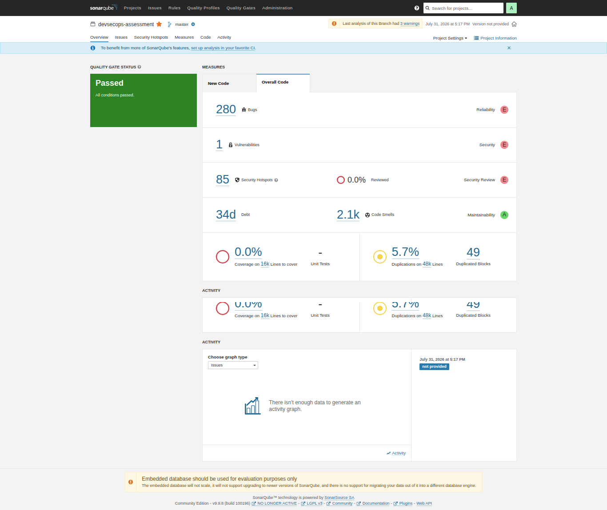
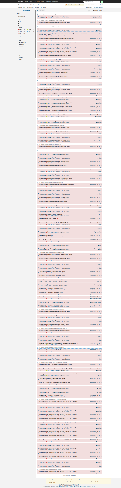
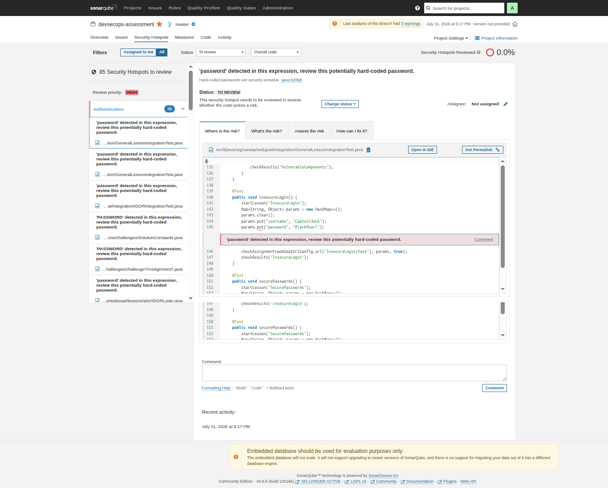
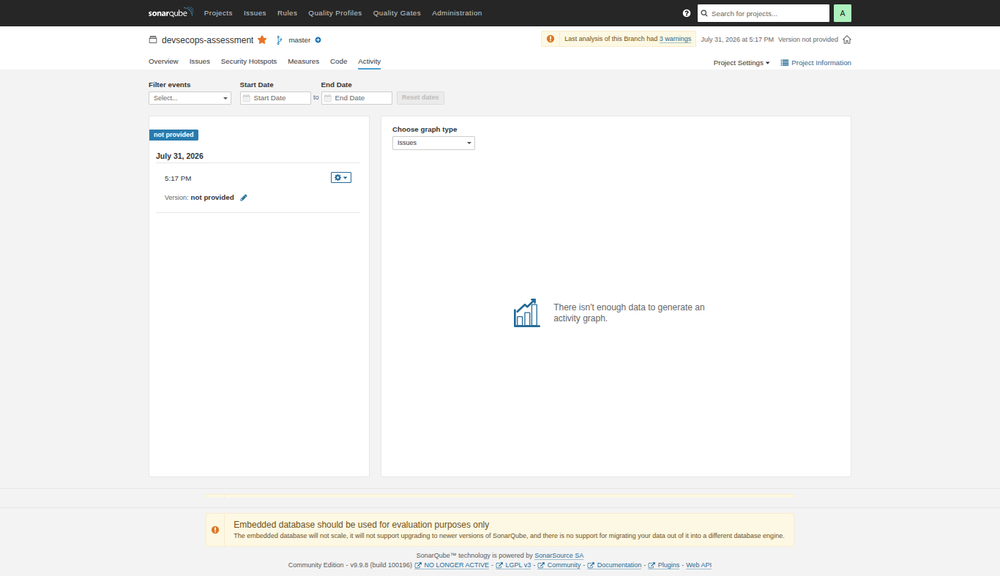

# SonarQube (SAST)

## 1. Overview

SonarQube merupakan **Static Application Security Testing (SAST)** platform yang digunakan untuk melakukan analisis terhadap source code **tanpa menjalankan aplikasi**. Pada assessment ini, SonarQube dijalankan menggunakan Docker, sedangkan proses scanning dilakukan menggunakan **SonarScanner Docker Image**.

Target aplikasi yang digunakan adalah **OWASP WebGoat**, yaitu aplikasi vulnerable yang memang dibuat untuk kebutuhan security learning dan penetration testing.

---

# 2. Objective

Tujuan dari task ini adalah:

- Deploy SonarQube menggunakan Docker
- Create a SonarQube Project
- Generate Authentication Token
- Scan OWASP WebGoat Source Code
- Analyze security findings
- Memahami proses Static Application Security Testing (SAST)

---

# 3. Deployment Architecture

```text
                +------------------------------+
                |      Developer Machine       |
                +--------------+---------------+
                               |
                               |
                               v
                +------------------------------+
                |     OWASP WebGoat Source     |
                |           Code               |
                +--------------+---------------+
                               |
                               |
                   SonarScanner (Docker)
                               |
                               |
                               v
                +------------------------------+
                |      SonarQube Server        |
                |      Docker Container        |
                +--------------+---------------+
                               |
                               |
                               v
                    Security Analysis Report
```

---

# 4. Environment

| Component | Version |
|-----------|---------|
| OS | Ubuntu 24.04 |
| Docker | 27.4.1 |
| Java | 25 |
| Maven | 3.8.7 |
| SonarQube | LTS Community |
| SonarScanner | Docker Latest |

---

# 5. Deployment Steps

## 5.1 Start SonarQube Container

Jalankan container SonarQube menggunakan Docker.

```bash
docker run -d \
  --name sonarqube \
  -p 9000:9000 \
  sonarqube:lts-community
```

Verifikasi container:

```bash
docker ps
```

Pastikan status container **Running**.

---

## 5.2 Access SonarQube

Buka browser:

```
http://localhost:9000
```

Default credential:

```
Username : admin
Password : admin
```

Pada login pertama, ubah password administrator.

---

## 5.3 Create Project

Buat project baru dengan konfigurasi:

```
Project Name : devsecops-assessment
Project Key  : devsecops-assessment
Main Branch  : master
```

Kemudian generate **User Token** yang akan digunakan oleh SonarScanner.

---

## 5.4 Build WebGoat

Sebelum melakukan scanning, project harus berhasil di-compile agar folder `target/classes` tersedia.

```bash
mvn clean compile
```

Verifikasi hasil compile:

```bash
ls target/classes
```

---

## 5.5 Run SonarScanner

Karena SonarScanner CLI tidak di-install secara lokal, proses scanning dilakukan menggunakan Docker.

```bash
docker run --rm \
  --network host \
  -e SONAR_HOST_URL=http://localhost:9000 \
  -e SONAR_TOKEN=<YOUR_TOKEN> \
  -v "$(pwd):/usr/src" \
  sonarsource/sonar-scanner-cli \
  -Dsonar.projectKey=devsecops-assessment \
  -Dsonar.projectName=devsecops-assessment \
  -Dsonar.sources=src \
  -Dsonar.java.binaries=target/classes
```

Setelah proses selesai, hasil analisis dapat dilihat melalui Dashboard SonarQube.

---

# 6. Troubleshooting

### Case 1 - HTTP 403 Forbidden

Saat mencoba download SonarScanner CLI secara manual, muncul error:

```
403 Forbidden
```

**Solution**

Menggunakan image Docker `sonarsource/sonar-scanner-cli` sehingga tidak perlu download binary secara manual.

---

### Case 2 - Java Version Not Supported

```
release version 25 not supported
```

**Cause**

Versi Java pada local machine masih menggunakan Java 17, sedangkan WebGoat membutuhkan Java 25.

**Solution**

Upgrade JDK menjadi Java 25.

---

### Case 3 - target/classes Not Found

```
No files nor directories matching target/classes
```

**Cause**

Project belum berhasil di-build.

**Solution**

Compile project terlebih dahulu menggunakan:

```bash
mvn clean compile
```

---

# 7. Scan Result

Setelah scanning berhasil, SonarQube menampilkan beberapa informasi seperti:

- Bugs
- Vulnerabilities
- Code Smells
- Security Hotspots
- Security Rating
- Reliability Rating
- Maintainability Rating
- Quality Gate Status

---

# 8. outputs

## Dashboard



## Project Overview


## Issues



## Security Hotspots



## Code


## Activity



---

# 9. Conclusion

Pada task ini berhasil dilakukan deployment SonarQube menggunakan Docker dan proses scanning terhadap **OWASP WebGoat** menggunakan **SonarScanner Docker Image**.

Hasil analisis menunjukkan berbagai metrik kualitas kode seperti **Bugs, Vulnerabilities, Code Smells, Security Hotspots**, serta **Quality Gate**. Dengan pendekatan ini, proses SAST dapat dilakukan secara otomatis sebagai bagian dari pipeline DevSecOps sehingga potensi security issue dapat ditemukan lebih awal sebelum aplikasi di-deploy ke production environment.