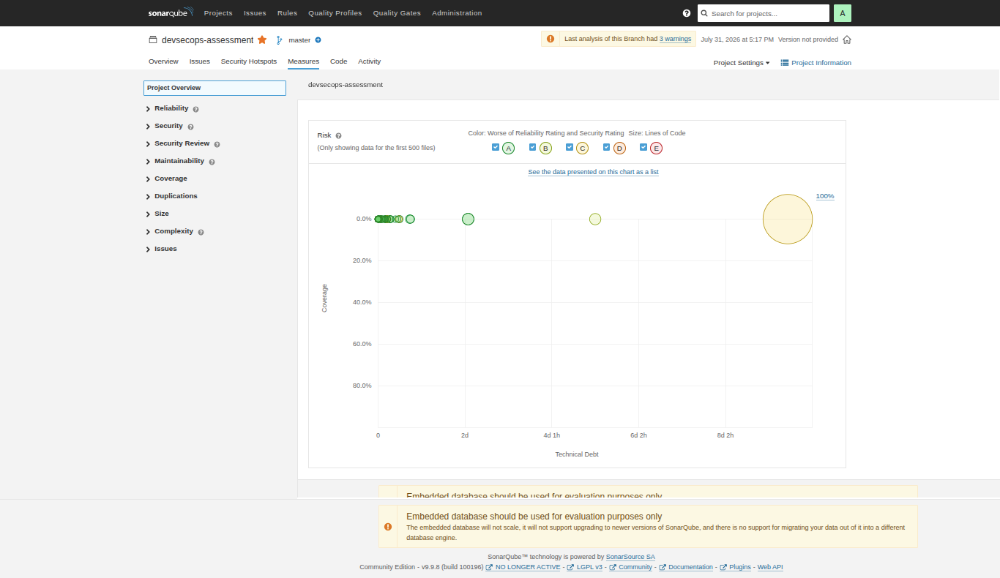
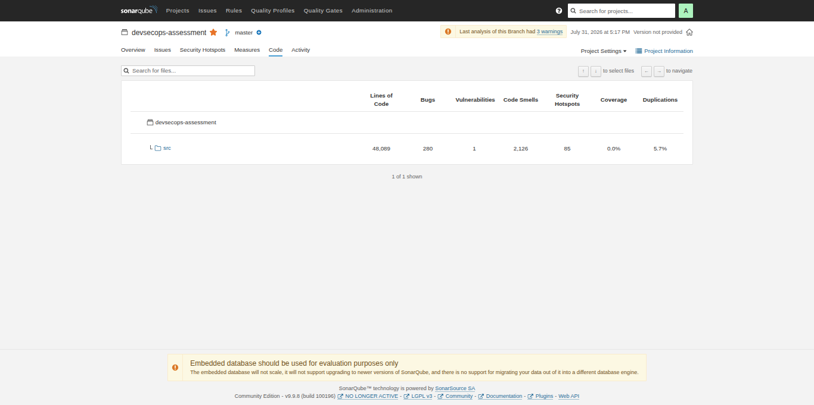

# SonarQube (SAST)

## 1. Overview

SonarQube is a Static Application Security Testing (SAST) platform used to analyze source code without executing the application.

This lab uses:

- SonarQube Community Edition (Docker)
- SonarScanner CLI (Docker)
- OWASP WebGoat as the vulnerable target application

---

## 2. Objective

The objectives of this lab are:

- Deploy SonarQube using Docker
- Create a SonarQube Project
- Generate an authentication token
- Analyze OWASP WebGoat source code
- Review security findings
- Understand SAST workflow

---

## 3. Architecture

```text
                  +----------------------------+
                  |      Developer Machine     |
                  +-------------+--------------+
                                |
                                |
                                v
                  +----------------------------+
                  |      OWASP WebGoat         |
                  |      Source Code           |
                  +-------------+--------------+
                                |
                                |
                     SonarScanner CLI (Docker)
                                |
                                |
                                v
                  +----------------------------+
                  |        SonarQube           |
                  |      Docker Container      |
                  +-------------+--------------+
                                |
                                |
                                v
                     Security Analysis Report
```

---

# 4. Environment

| Component | Version |
|-----------|---------|
| Docker | 27.4.1 |
| Java | 25 |
| Maven | 3.8.7 |
| SonarQube | LTS Community |
| SonarScanner | Docker Latest |
| OS | Ubuntu 24.04 |

---

# 5. Deployment Steps

### Start SonarQube

```bash
docker run -d \
  --name sonarqube \
  -p 9000:9000 \
  sonarqube:lts-community
```

---

### Verify Container

```bash
docker ps
```

Expected output:

```text
sonarqube:lts-community
STATUS Up
PORT 9000
```

---

### Access SonarQube

Open browser

```
http://localhost:9000
```

Default credential

```
admin
admin
```

---

### Change Password

After first login

- Change default password
- Login again

---

### Create New Project

Project Name

```
devsecops-assessment
```

Project Key

```
devsecops-assessment
```

Main Branch

```
master
```

---

### Generate User Token

Administration

↓

Security

↓

Generate Token

Example

```
sqp_xxxxxxxxxxxxxxxxxxxxx
```

---

# 6. Build Project

Compile WebGoat

```bash
mvn clean compile
```

Verify

```bash
target/classes
```

---

# 7. Run SonarScanner

```bash
docker run --rm \
  --network host \
  -e SONAR_HOST_URL=http://localhost:9000 \
  -e SONAR_TOKEN=<YOUR_TOKEN> \
  -v "$(pwd):/usr/src" \
  sonarsource/sonar-scanner-cli \
  -Dsonar.projectKey=devsecops-assessment \
  -Dsonar.projectName=devsecops-assessment \
  -Dsonar.sources=src \
  -Dsonar.java.binaries=target/classes
```

---

# 8. Troubleshooting

## Problem 1

403 Forbidden while downloading SonarScanner

Cause

Official download URL is unavailable.

Solution

Use Docker image

```
sonarsource/sonar-scanner-cli
```

---

## Problem 2

```
No files nor directories matching target/classes
```

Cause

Project has not been compiled.

Solution

```
mvn clean compile
```

---

## Problem 3

```
release version 25 not supported
```

Cause

WebGoat requires Java 25.

Solution

Upgrade JDK

```
Java 25
```

---

# 9. Scan Result

After successful analysis SonarQube displays

- Bugs
- Vulnerabilities
- Code Smells
- Security Hotspots
- Security Rating
- Reliability Rating
- Maintainability Rating
- Quality Gate

---

# 10. Screenshots

## Dashboard


---

## Project Overview



---

## Issues


---

## Security Hotspots


---

## Code



---

## Activity


---

# 11. Conclusion

The SonarQube analysis successfully scanned the OWASP WebGoat project using Docker-based SonarScanner.

The analysis provides comprehensive code quality and security metrics, including bugs, vulnerabilities, code smells, security hotspots, and Quality Gate status. These findings help developers improve code quality and detect security issues early in the Software Development Lifecycle (SDLC).